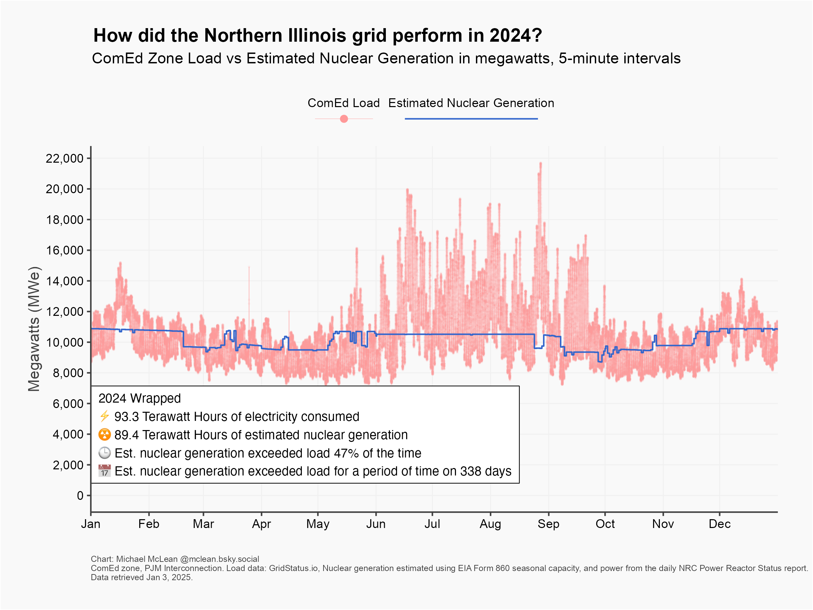

# 2024 Illinois Nuclear Review

This project analyzes the relationship between ComEd zone load and nuclear generation in Northern Illinois throughout 2024, providing insights into how nuclear power met electricity demand.

## Data

The analysis uses 5-minute interval data stored in `data/comed_load_and_nuclear_2024.csv` with the following structure:

| interval_start_ct | comed_load_mwe | est_nuclear_generation_mwe |
|-------------------|----------------|---------------------------|
| 2024-01-01 00:00:00 | 12,345 | 11,000 |
| 2024-01-01 00:05:00 | 12,400 | 11,000 |
| ... | ... | ... |

Where:
- `interval_start_ct`: Timestamp in Central Time
- `comed_load_mwe`: ComEd zone load in megawatts electric (MWe)
- `est_nuclear_generation_mwe`: Estimated nuclear generation in megawatts electric (MWe)

## Methodology

The analysis script (`analysis.r`) performs the following operations:

1. Loads and processes the 5-minute interval data
2. Calculates the ratio of nuclear generation to load
3. Computes key statistics:
   - Percentage of time nuclear exceeded load
   - Number of days where nuclear exceeded load at any point
   - Total load in Terawatt-hours (TWh)
   - Total nuclear generation in TWh
4. Creates a visualization showing:
   - ComEd zone load (red points and thin line)
   - Estimated nuclear generation (blue line)
   - Monthly x-axis ticks
   - Key statistics annotation
   - Proper attribution and data sources

## Results

The visualization below shows the relationship between ComEd zone load and estimated nuclear generation throughout 2024:

The chart includes:
- Load data points at 5-minute intervals (red)
- Estimated nuclear generation line (blue)
- Summary statistics showing:
  - Total electricity consumption in TWh
  - Total nuclear generation in TWh
  - Percentage of time nuclear exceeded load
  - Number of days where nuclear exceeded load

Data sources:
- ComEd zone load data from GridStatus.io
- Nuclear generation estimated using:
  - EIA Form 860 seasonal capacity
  - Daily NRC Power Reactor Status report
